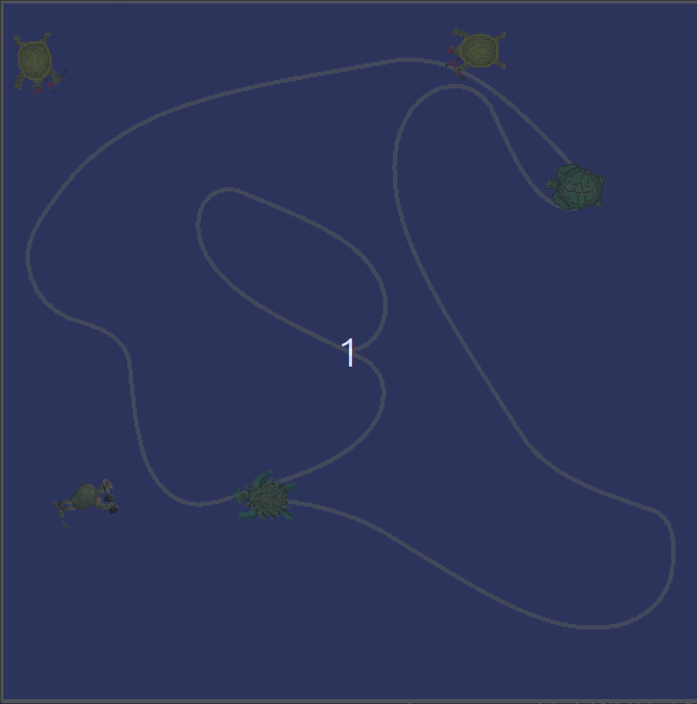

# ROS 2 Turtlesim – Catch Them All 🐢🎯

<p align="center">
  
</p>

## Overview

This project is a **ROS 2 multi-node simulation** built on `turtlesim` that demonstrates **autonomous target spawning, tracking, and capture** using services, topics, closed-loop control, and parameterised behaviour.

A controller turtle continuously tracks and navigates towards dynamically spawned target turtles, selecting targets based on configurable decision logic (e.g. closest-first) and removing them via a custom service interface.

The project is designed to showcase **ROS 2 system architecture**, **service-based coordination**, and **feedback control** in a clean, modular way.

---

## System Architecture

The system is composed of two main ROS 2 nodes:

### 1. Turtle Spawner Node
- Periodically spawns turtles at random positions and orientations  
- Maintains a list of currently alive turtles  
- Publishes turtle state information to the rest of the system  
- Exposes a service to remove (catch) turtles on request  

### 2. Turtle Controller Node
- Subscribes to the main turtle’s pose  
- Subscribes to the list of alive turtles  
- Selects a target turtle based on configurable logic  
- Uses proportional control to navigate towards the target  
- Calls a service to remove the turtle once it is reached  

Nodes communicate using:
- **Topics** for state feedback  
- **Services** for event-driven actions  
- **Parameters** for behaviour configuration  

---

## Key Features

- ROS 2 multi-node architecture  
- Service-based coordination (`Spawn`, `Kill`, custom catch service)  
- Closed-loop feedback control using pose data  
- Target-selection logic (closest-first or ordered)  
- Parameterised behaviour via YAML configuration  
- Launch-based system orchestration  

---

## Control Logic (High-Level)

- Distance and heading to the target turtle are computed using pose feedback  
- Linear velocity is scaled proportionally to distance  
- Angular velocity is computed using angular error normalisation  
- Once within a distance threshold, the controller triggers a service call to remove the target  

This mirrors core ideas used in:
- Mobile robot navigation  
- Target tracking  
- Reactive control systems  

---

## Configuration

System behaviour can be modified using ROS 2 parameters:

- Spawn frequency  
- Turtle name prefix  
- Target-selection strategy (closest-first vs list order)  

These parameters are defined in a YAML configuration file and loaded at launch time.

---

## Launching the System

After building your ROS 2 workspace:

```bash
ros2 launch turtlesim_catch_them_all turtlesim_catch_them_all.launch.xml
